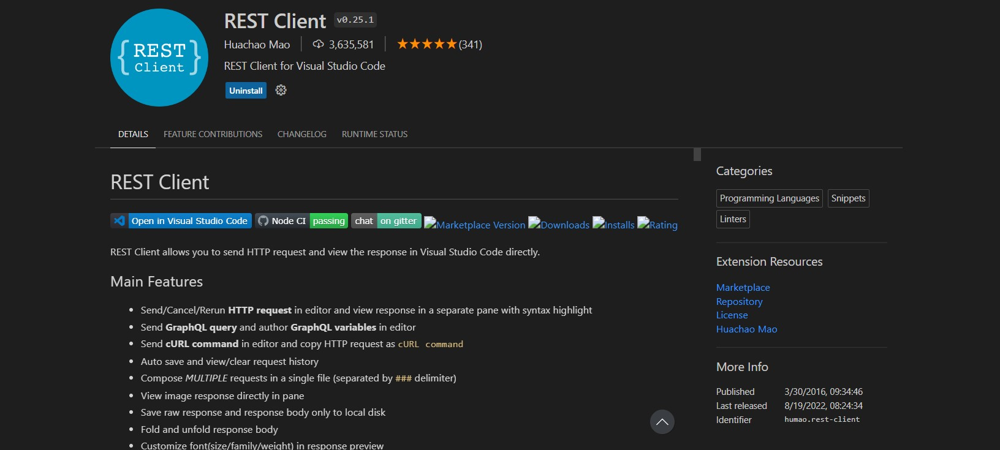
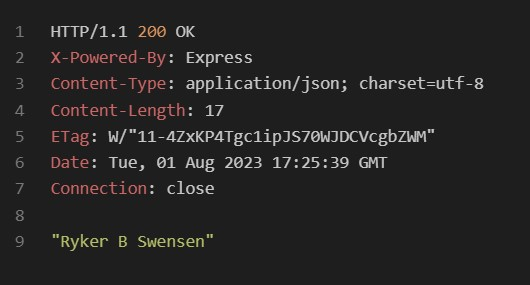
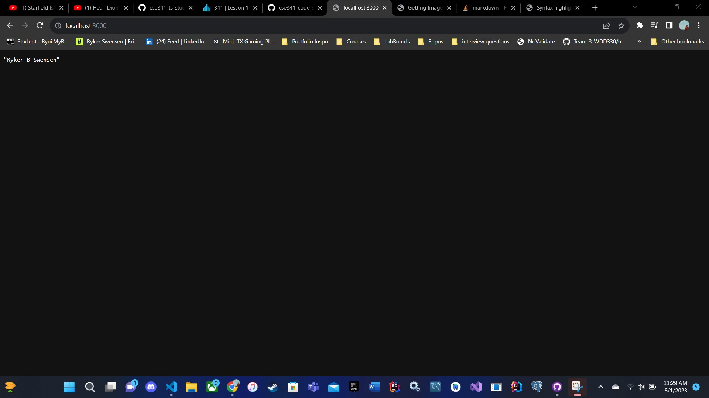
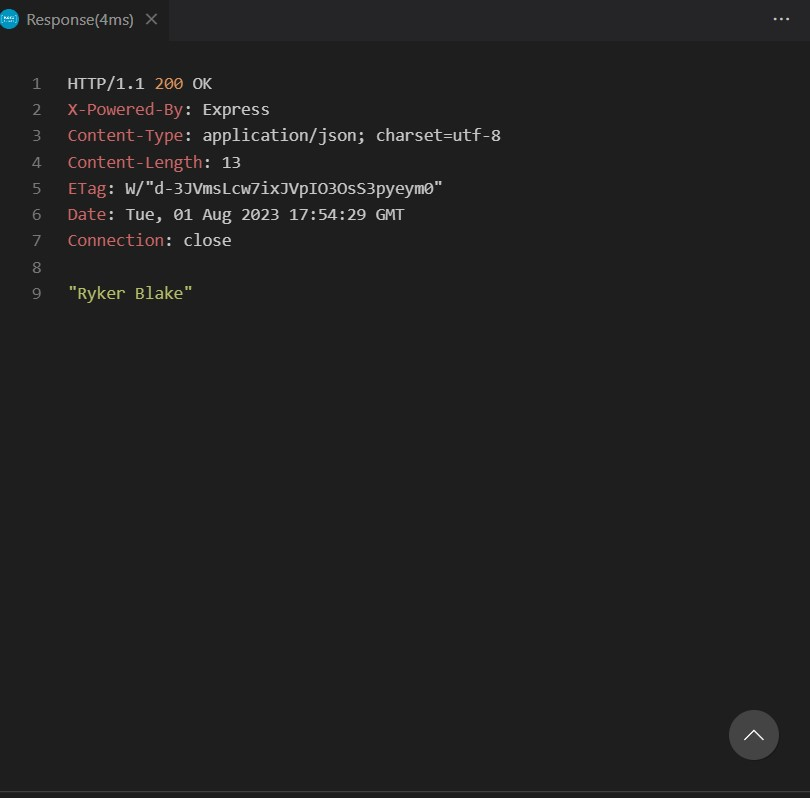
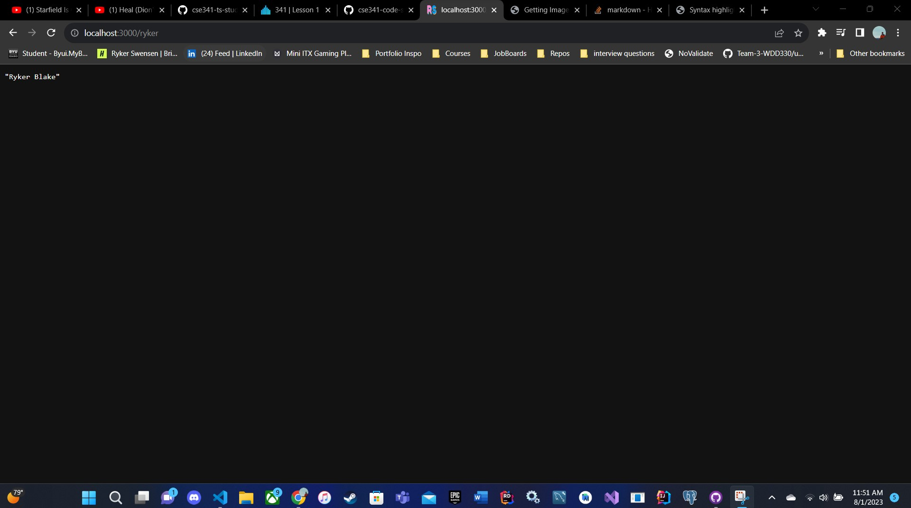

# Setup Introduction

To get started, you will need to complete some initial setup. 

First, make sure that you have VSCode, or have an IDE that is compatible with TS and NodeJS. 

Next, make sure that you have Git installed and have created a GitHub account. 

Lastly, create free accounts on Render and MongoDB. We will be using MongoDB as a database platform and Render as our hosting platform. 

Once the installation is complete, you are ready to begin. 

### Installs
```sh
npm init -y
touch server.ts
npm install express
npm install typescript
npm install @types/express @types/node
npx tsc --init
```

### tsconfig.json
After running tsc --init, you should have a tsconfig.json file.
Open the new file.
Around line 52, you should see outDir, and it is commented out. 
Remove the comments, and replace the path to ./dist
Now, run:
```sh
npx tsc
```
You should now see the dist folder.
If you did not have it appear, run node dist/server.js. This should make it appear.
The dist folder is what we will use to transiple our typescipt back into JavaScript for the browser.

### package.json
Now, open package.json, and go to scripts.
Remove anything that was there. 
Lets add a build to transpile typescript to javascript
```json
"build": "npx tsc",
"start": "node dist/index.js"
```

Now, lets make that automated, so that we don't have to build every time and so that we don't need to refresh.

```sh
npm install -D nodemon
```

Now let's go back to the scripts, and lets add: 
```json
"serve": "npx tsc -w & nodemon dist/index.js"
```
The "W" stands for watch mode.
Right now, our dist folder is not being emptied after it is built. 
Let's make it so that it empties and is rebuilt each time it is ran.

```sh
npm install rimraf
```

Now, let's alter the build. 
```json
"build": "rimraf dist && npx tsx",
```

Now, let's add a prestart command to have commands called before we run start. 
```json
"prestart": "npm run build",
```


Let's do the same for serve and add a preserve:
```json
"preserve": "npm run build",
```

Now, to break this down, when we run npm start, it now runs the prestart, which runs the build. So, now when we run our 
code, the dist folder is emptied, and then the typescript is recompiled, then it runs the start command.

Now, let's add a package so that it runs concurrently. (This way it works on Windows and Linux)
```sh
npm install concurrently
```

Now, let's add this package to the serve command. 
```json
"serve": "concurrently \"npx tsc -w\" \"nodemon dist/index.js\""
```

Now, as we make changes to the program, everytime we save, the program will be updated and rerun. 
Just make sure you remember to run: 
```sh
npm run serve
```
Because of the way I set up my package.json, you will need to run npm run serve rather than run start. 
If you would rather do npm run dev, change the name from serve to dev, and preserve to predev.

# Assignment Directions

## Now You Are Ready To Code!

### server.ts
Open the package.json file, alter main from index.js to server.ts

Now, create a new file named server.ts

We need to import express.

```ts
import express, { Express } from 'express';
```
We need to create a new express application.

```ts
const app: Express = express();
```

We will need to create a function for If there is a port 
in an enviorment variable, which Render uses, then it will use that port. If not, it uses localhost3000.

```ts
const port: string | number = process.env.PORT || 3000;
```

We need to tell our app to listen for requests on the specified port.
To do this, we will use the listen method on our app object.

```ts
app.listen(port, () => {
    console.log(`Server running on port ${port}`)
});
```

### Routes
Routes can get large, and most likely, you are going to have multiple files for your routes. 
Let's make a folder for our routes and name it routes.

Inside of the routes folder, create a new file, and name it index.ts

We need to import the router from express. 

```ts
import { Router } from 'express';
```

Create a new router object.
```ts
const routes = Router();
```

Now, we need to export the router object.

```ts
export default routes;
```

Now, return to server.js, we need to import the routes we just exported.
```ts
// We need to import our routes from the routes folder.
import routes from './routes';

```
Staying inside sever.js, we need to comminicate to the program that we are using the routes we defined.
AKA anything after the root path.
```ts
app.use('/', routes)
```

### Controllers
The next step is to add a folder for our controllers, we will name the folder controllers.

We will now create a new file and name it index.ts

Now that we have a server and routes setup, let's see if we can add our response in the controller.

We need to import Request and Response from express to be able to use them.
```ts
import { Request, Response } from 'express';
```
Typscript allows us to specify the type of the parameters and the return value of a function.
We could simply use req and res, but the more proper way to type them would be Request and Response.
This function takes a Request and a Response object as parameters, it does not return anything.
We use void to specify that it does not return anything.
The function is called rykerFunction.
In this function, we can place anything we want to do when the client sends a GET request to the '/' path.
For this lesson, we are asked to write a name of someone we know.
I am going to write the name of my wife Corinne.
Note that we need to send the response back to the client. When the response is sent, the function will end.
200 is the status code for 'OK'. It means that the request was successful.
```ts
const rykerFunction = (req: Request, res: Response): void => {
  const data =
    'Corinne Swensen';
  res.status(200).send(data);
};
```

This function is called returnAnotherRyker.
Here we will return a name of someone else I know. 
I will enter my best friend. His name is Bubba Moon.
```ts
const returnAnotherRyker = (req: Request, res: Response): void => {
    const data =
      'Bubba Moon';
    res.status(200).send(data);
  };
```

// Export the displayJoke function so it can be imported in other modules (files).
```ts
export { rykerFunction, returnAnotherRyker };
```

Now, let's go back to routes/index.ts and import our controller.

```ts
import { rykerFunction } from '../controllers/';
import { returnAnotherRyker } from '../controllers/';
```

Here, we will add a git to the router. 
The router will handle any requests that come to the '/' path.
The '/' path is the root path. It is the path that comes after the domain name.
For example, if the domain name is 'www.google.com', the root path would be 'www.google.com/'.
We also need to make another path for the other function we made.
```ts
routes.get('/', rykerFunction);
routes.get('/ryker', returnAnotherRyker);
```

Now, lets run:

```sh
npm i --save-dev nodemon
```
This will alow us to run our code and have nodemon watch for changes.

### Installing a Rest Client Extension
If you are using VSCode for this project, it is recommended to install the REST Client 
extension by Huachao Mao. 
[Rest Client Extension](https://vscode.dev/github/Huachao/vscode-restclient)


<p align="center">
  
</p>

### .rest
Once you have installed a rest client extension, create a new file, name the new file .rest

```rest
GET http://localhost:3000/ HTTP/1.1
```

### Testing the Response!
Now run:

```sh
npm run serve
```
Go into the .rest file, and click "Send Request."

You should get a 200 or OK response. You should also see Ryker B Swensen at the bottom of the response.

<p align="center">
  
</p>

If you open up to localhost3000, you will see the name in the browser like this:
<p align="center">
  
</p>

### Adding Another Route
Let's try to add another route!
Start by going into the controller. 
Implementing the same layout of rykerFunction, simply create another by changing the function name and the content within the JSON:
```ts
const rykerFunction = (req: Request, res: Response): void => {
  const data =
    'Ryker Blake';
  res.status(200).send(data);
};
```
Now, return to routes. 
Specify a route that will return the json. 
```js
routes.get('/ryker', myController.returnAnotherRyker);
```

Add the new route to see if your controller and or route are working. 

In the .rest file, you need to use three pound signs "#" to express that it is a new request.

```rest
###
GET http://localhost:3000/ryker HTTP/1.1
```
You should get a 200 OK, and see the JSON of the new route.
I am expecting to see "Ryker Blake" if I add the route /ryker
<p align="center">
  
</p>

Now, let's try it in the browser.

<p align="center">
  
</p>


### Git Ignore 
Create a new file named .gitignore

Inside of the GitIgnore, we want to ignore the Node Modules. We do this because Node Modules are large in size, and it is easy enough to set and install dependencies.

```txt
node_modules
```

# Testing!
Make sure that your routes and requests work. 

# TODO
I need to add this to RENDER, Spell Check, Peer Review, and Submit to Brother Birch. And YouTube Vid